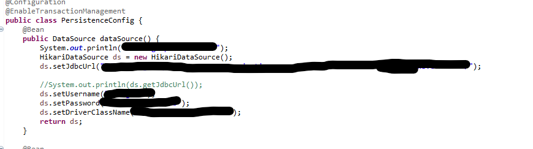
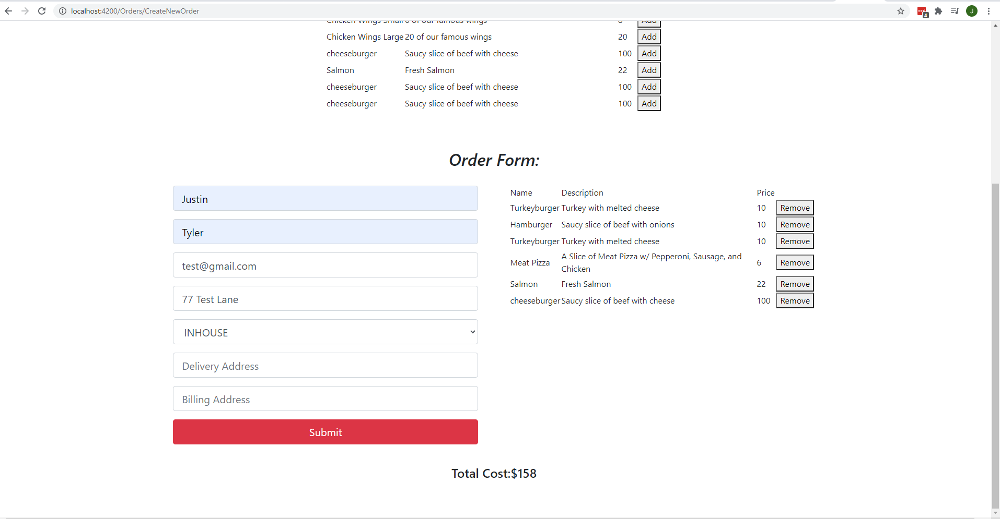

# Beefy Billy's Ordering and Delivery Service

## Project Description

Restaurant Delivery App is a web-app designed to facilitate Customers ordering food from a restaurant online for delivery or pick up. The Customer is also able to create a reservation at the restaurant for a future date. Employees of this establishment are able to view pending orders and update the status as completed or canceled, as well as submit new orders if the Customer orders over the phone. Employees may also view and update the list of reservations as well as make a reservation for Customers. Managers can make changes to the menu as well as see a list of all orders regardless of status. Managers can also create Employees.

## Technologies Used

* Java - version 1.8
* Spring MVC - version 4.3
* Spring ORM - version 4.3
* Spring Test - version 4.3
* Hibernate - version 4.3.11.Final
* JUnit - version 4.1
* Log4J - version 1.2
* PostgreSQL - version 8.5
* Tomcat - version 8
* AWS RDS 
* Angular - version 9
* Bootstrap - version 4
* HTML5
* TypeScript
* JavaScript - ECMAScript 5

## Features

Customer Features
* Create online orders
* Make reservations

Management Features
* Manage restaraunt menu
* Manage orders
* Manage employees
* View customer data
* Create online orders
* Make reservations

To-do list:
* Improve Styling

## Getting Started
   
git clone https://github.com/justinkroh22/restaurantwebapp.git

Back End:

1. Open the restaurantappserver in your IDE used for java
2. Gain a copy of the persitence configuration from the owner of the repo to connect to the database
3. Run the application in tomcat server

Front End:

1. Open the restaurantwebapp in your IDE used for angular
2. Run npm -install
3. Run ng serve --open

Example of Persistance Configuration:

Homepage:

## Usage

> Here, you instruct other people on how to use your project after they’ve installed it. This would also be a good place to include screenshots of your project in action.

## Contributors

* Justin Kroh
* Ronald Martz
* Pascaline Mukakamari

